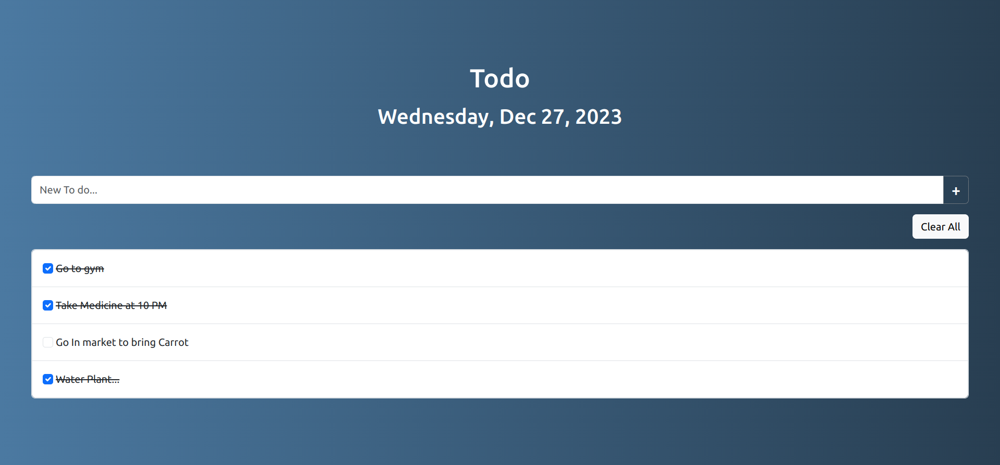

# My Todo Web App

A simple todo web app created using HTML, JavaScript, and Bootstrap.

## Table of Contents

- [Overview](#overview)
- [Features](#features)
- [Screenshot](#screenshot)
- [Getting Started](#getting-started)
- [Usage](#usage)
- [Contributing](#contributing)

## Overview

My Todo Web App allows users to create and manage their todo lists with ease.

## Features

- Add new todo items
- Mark items as completed
- Clear all todos

## Screenshot

## Getting Started

To run this project locally, follow these steps:

1. Clone the repository.
2. Open `index.html` in your preferred web browser.

## Usage

1. Enter a new todo in the input field.
2. Click the "+" button or press Enter to add the todo.
3. Mark a todo as completed by clicking the checkbox.
4. Click "Clear All" to remove all todos.

## Contributing

Feel free to contribute by creating issues or submitting pull requests. Please follow the coding standards.